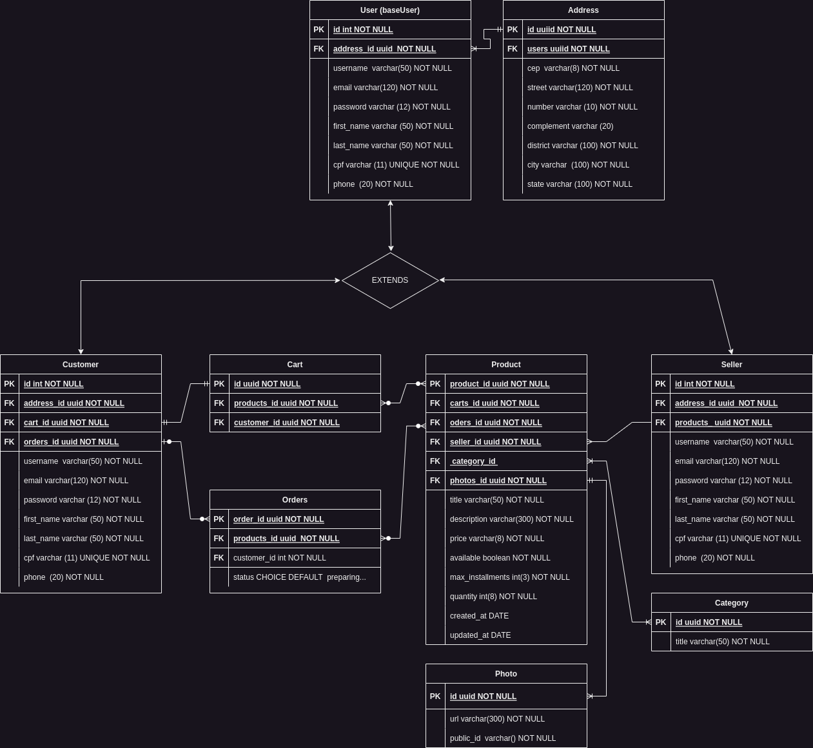

# Layover skateshop

## API Documentation

### Index

- [General vision](#1-general-vision)
- [Entities Relationship Diagram ](#2-entities-relationship-diagram)
- [Quickstart](#3-quickstart)
  - [Installing Dependencies](#31-installing-dependencies)
  - [Environment Variables](#32-environment-variables)
  - [Migrations](#33-migrations)
- [Endpoints](#4-endpoints)

---

## 1. General vision

Some of the tecnologies that has been used in this project

- [NodeJS](https://nodejs.org/en/)
- [Express](https://expressjs.com/pt-br/)
- [TypeScript](https://www.typescriptlang.org/)
- [PostgreSQL](https://www.postgresql.org/)
- [TypeORM](https://typeorm.io/)
- [Yup](https://www.npmjs.com/package/yup)

Application base URL:
http://myapi.com/v1

---

## 2. Entities Relationship Diagram

[ Get back to the top ](#index)

Below the diagram ilustrates the relations between the entities from the database



---

## 3. Quickstart

[ Get back to the top ](#index)

### 3.1. Installing Dependencies

In your machine clone the repository

```shell
git clone git@github.com:Mazuquiebe/layoverskateshop.server.git
```

Install dependencies with the command below:

```shell
yarn
```

### 3.2. Environment Variables

Then, create a **.env** file, and copy the content from **.env.example**:

```
cp .env.example .env
```

Before, set the variables values with your postgres credentials:

```
DB_HOST=database_host

POSTGRES_USER=your_psql_user

POSTGRES_PASSWORD=your_psql_password

#remember you should create a database to be accessed and insert its name here
POSTGRES_DB=database_name

#port where the server will run you can change it if already being used.
PORT=3000
```

### 3.3. Migrations

Execute the migrations with the command below:

```
yarn typeorm migration:run -d src/data-source.ts
```

---

## 4. Endpoints

[ Get back to the top ](#index)

### Endpoints Index

- [Users](#1-users)
  - [POST - /users](#11-criação-de-usuário)
  - [GET - /users/:user_id](#12-get-user-data-by-id)
- [Products](#2-products)
- [Cart](#3-cart)
- [Users](#4-buys)

---

## 1. **Users**

[ Get back to Endpoints ](#5-endpoints)

The User object is defined as follows:

| Key      | Type     | Description                                                                        |
| -------- | -------- | ---------------------------------------------------------------------------------- |
| id       | string   | User Unique identifier                                                             |
| username | string   | Username it is like a unique nickname wich the user can use to access the account. |
| email    | string   | e-mail credential, user can use it to access the account too.                      |
| password | string   | User password credential                                                           |
| adm      | boolean  | Define if user has administrator permissions or not                                |
| address  | IAddress | User address where he/she will receive his/her deliveries                          |

### Address

The Address object is defined as follows:

| Key        | Type   | Description                                                          |
| ---------- | ------ | -------------------------------------------------------------------- |
| cep        | string | cep is the address code used in Brazil to localize determined street |
| street     | string | name from street                                                     |
| district   | string | name from the district                                               |
| number     | number | number from the user residence                                       |
| complement | string | optional complement                                                  |
| city       | string | name from the city                                                   |
| state      | string | name from the state                                                  |

### Endpoints

| Método | Rota                    | Descrição           |
| ------ | ----------------------- | ------------------- |
| POST   | /users                  | Create an account   |
| GET    | /users/:user_id         | get user data by ID |
| PATCH  | /users/update/:user_id  | update user data    |
| DELETE | /users/destroy/:user_id | delete user account |

---

## 1.1. **Create user account**

[ Get back to Endpoints ](#5-endpoints)

### `/users`

### Request example:

```
POST /users
Host: http://myapi.com/v1
Authorization: None
Content-type: application/json
```

### Request body:

```json
{
  "username": "Jhon",
  "first_name": "Jhon",
  "last_name": "Doe",
  "email": "jhon@mail.com",
  "cpf": "12345675987",
  "phone": "0000000000",
  "password": "sTrOnGP4SsWoRd",
  "adm": true,
  "address": {
    "cep": "00000000",
    "street": "My street name",
    "number": 005,
    "complement": "optional complement",
    "district": "My neighborhood",
    "city": "My city name",
    "state": "My state"
  }
}
```

<!-- ### Schema de Validação com Yup:

```javascript
name: yup
        .string()
	.required()
	.transform((value, originalValue) => {
		return titlelify(originalValue)
	}),
email: yup
        .string()
	.email()
	.required()
	.transform((value, originalValue) => {
		return originalValue.toLowerCase()
	}),
password: yup
        .string()
	.required()
	.transform((value, originalValue) => {
		return bcrypt.hashSync(originalValue, 10)
	}),
isAdm: yup
        .boolean()
	.required(),
```

OBS.: Chaves não presentes no schema serão removidas. -->

### Response Example:

```
201 Created
```

```json
{
  "id": "4870aa33-4f2f-4737-a2a0-8ae5f145552b",
  "username": "Jhon",
  "first_name": "Jhon",
  "last_name": "Doe",
  "email": "jhon@mail.com",
  "cpf": "12345675987",
  "phone": "0000000000",
  "created_at": "2023-04-13T01:32:21.171Z",
  "updated_at": "2023-04-13T01:32:21.171Z",
  "address": {
    "id": "09cfb8cc-04fd-44d5-9514-d785a43f8ac0",
    "cep": "00000000",
    "street": "My street name",
    "number": 005,
    "complement": "optional complement",
    "district": "My neighborhood",
    "city": "My city name",
    "state": "My state"
  }
}
```

### Possible Errors:

| Error code   | Description                  |
| ------------ | ---------------------------- |
| 409 Conflict | Email already registered.    |
| 409 Conflict | Username already registered. |

---

## 1.2. **Authenticate User**

[ Get back to Endpoints ](#5-endpoints)

### `/users/auth`

### Request example:

```
POST /users/auth
Host: http://myapy.com/v1
Authorization: None
Content-type: application/json
```

### Request body:

```json
"email": "jhon@mail.com",
"password": "sTrOnGP4SsWoRd"
```

or

```json
"username": "Jhon",
"password": "sTrOnGP4SsWoRd"
```

## Response example

```json
"token": "fdsfsdffç.sadfdsfdsfdsvvsdvsdvsdfsfddsfdsfsdfdsvsdvdsfsfdsvvsdfdsffdfafdbngh"
```

---

## 1.3. **Get user data by id**

[ Get back to Endpoints ](#5-endpoints)

### `/users`

### Request example:

```
GET /users
Host: http://myapy.com/v1
Authorization: Bearer Token
Content-type: application/json
```

### Request Parameters:

| Parameter | Type   | Description            |
| --------- | ------ | ---------------------- |
| user_id   | string | Unique User Identifier |

### Request body:

```json
Empty
```

### Response example:

```
200 OK
```

```json
{
  "id": "4870aa33-4f2f-4737-a2a0-8ae5f145552b",
  "username": "Jhon",
  "first_name": "Jhon",
  "last_name": "Doe",
  "email": "jhon@mail.com",
  "cpf": "12345675987",
  "phone": "0000000000",
  "created_at": "2023-04-13T01:32:21.171Z",
  "updated_at": "2023-04-13T01:32:21.171Z",
  "address": {
    "id": "09cfb8cc-04fd-44d5-9514-d785a43f8ac0",
    "cep": "00000000",
    "street": "My street name",
    "number": 005,
    "complement": "optional complement",
    "district": "My neighborhood",
    "city": "My city name",
    "state": "My state"
  }
}
```

### Possible Errors:

| Error code    | Description                        |
| ------------- | ---------------------------------- |
| 404 Not Found | ID does not match with any account |

---

## 1.4. **Update user data**

[ Get back to Endpoints ](#5-endpoints)

### `/users/update/:user_id`

### Request example:

```
PATCH /users/update/4870aa33-4f2f-4737-a2a0-8ae5f145552b
Host: http://myapy.com/v1
Authorization: Bearer Token
Content-type: application/json
```
